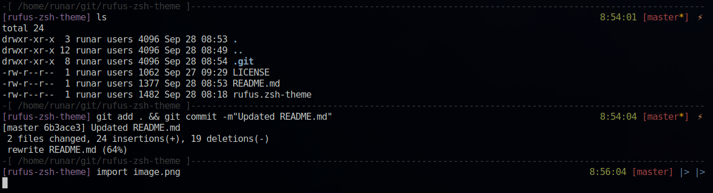
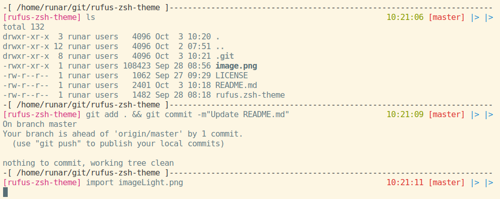

# rufus-zsh-theme
An oh-my-zsh theme.

## Installation:
1. Install [zsh](https://en.wikipedia.org/wiki/Z_shell)
2. Install [oh-my-zsh](https://ohmyz.sh/)
3. Copy or make a symlink from 'rufus.zsh-theme' into '~/.oh-my-zsh/custom/themes/' (make sure you're in the repo dir)
	* Substitute rufus.zsh-theme for rufus-minimal.zsh-theme if you wish to use the minimal version, or do it for both.
	* Symlink: `ln -s $(pwd)/rufus.zsh-theme ~/.oh-my-zsh/custom/themes/rufus.zsh-theme`
	* Copy: `cp ./rufus.zsh-theme ~/.oh-my-zsh/custom/themes/`
4. Add or edit the value of 'ZSH_THEME' in ~/.zshrc to be ``ZSH_THEME="rufus"``
5. Run ``source ~/.zshrc`` in a terminal
6. Enjoy!

## Q ( I don't have any FA Questions ):
#### What font should I use?
* Completely up to you, but preferably a monospaced font. I find Iosevka Term works well.

#### What is  `${time}$(git_prompt_info)$(git_prompt_status)$(git_prompt_ahead)$reset_color`?
* **Solution**: Update theme, the problem is solved.
* This happens when you terminate the loop/print process. If you press <kbd>ctrl</kbd>+<kbd>c</kbd> while the theme is trying to print the dashes ( - ), the script won't have time to run through the loop, and spits out an unformatted version of the prompt.

#### HELP! {x} does {y} and {y} is bad!
* Woops, need help with anything (oh-my-z)sh related? Submit an issue at [runarsf/rufus-zsh-theme](https://github.com/runarsf/rufus-zsh-theme/issues/new).

I'm looking into adding an optional feature to integrate the theme with my python shell todo-list ( runarsf/punct ).

## Screenshots

