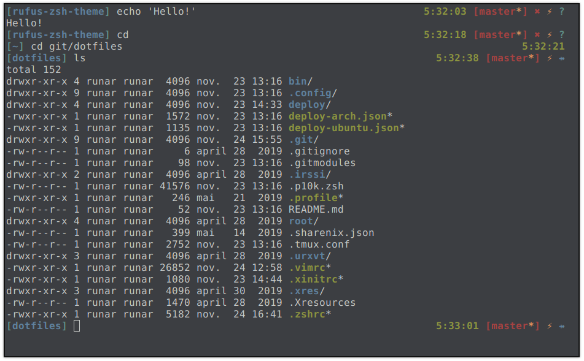

# rufus-zsh-theme

> An instant asynchronous theme for [oh-my-](https://github.com/ohmyzsh/ohmyzsh)[zsh](http://zsh.org).



### Installation
#### Plugin manager [antibody] (recommended)
```bash
antibody bundle runarsf/rufus-zsh-theme
```
#### Manual
```bash
git clone https://github.com/runarsf/rufus-zsh-theme.git

# symlink (recommended), original .zsh-theme file has to be static
ln -s $(pwd)/rufus-zsh-theme/rufus.zsh-theme $HOME/.oh-my-zsh/custom/themes/rufus.zsh-theme
# curl
curl --output $HOME/.oh-my-zsh/custom/themes/rufus.zsh-theme https://raw.githubusercontent.com/runarsf/rufus-zsh-theme/master/rufus.zsh-theme
# wget
wget --directory-prefix=$HOME/.oh-my-zsh/custom/themes/ https://raw.githubusercontent.com/runarsf/rufus-zsh-theme/master/rufus.zsh-theme

# Add this to your ~/.zshrc file
ZSH_THEME="rufus"
```

> **rufus-zsh-theme** © [runarsf](https://github.com/runarsf) · Author and maintainer.<br/>
> Released under the [MIT](https://opensource.org/licenses/mit) [License](https://github.com/runarsf/rufus-zsh-theme/blob/master/LICENSE).
